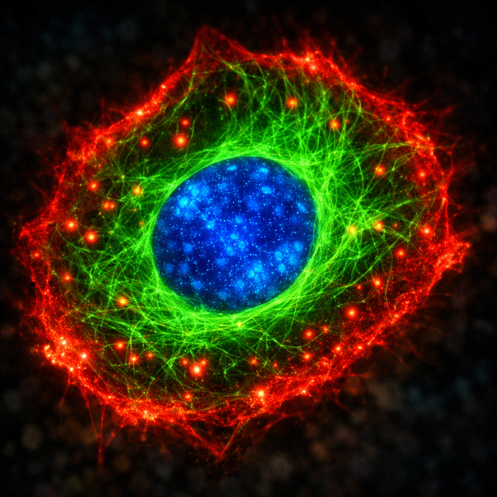

# ColorLayer

Interactive MATLAB GUI for creating false-color composite images from multiple 2D maps using additive color blending.

Uses the **AppBase + uihtml** architecture: HTML/CSS/JS frontend with MATLAB backend.



## Features

- **6 Color Channels**: Red, Green, Blue, Yellow, Cyan, Magenta (3x2 grid)
- **Per-Channel Controls**: Brightness, saturation, gamma, contrast min/max
- **Real-Time Preview**: JS-side compositing for instant slider feedback
- **Per-Channel Color Bars**: Draggable, resizable overlay on the composite showing effective data range per channel (included in PNG exports)
- **Interactive Histogram**: Per-channel with draggable contrast handles and auto-stretch
- **Zoom/Pan**: Mouse wheel zoom + drag pan on composite image
- **Pixel Inspector**: Hover to see per-channel raw values and composite RGB output
- **Normalize Maps Toggle**: Per-map normalization to [0,1] with automatic saturation slider adjustment
- **Background Blending**: Optional alpha blending with background image
- **Preset Management**: Save/load channel configurations
- **Flexible Input**: Load from MAT files, images (PNG, JPG, TIFF, BMP), or workspace variables (cell arrays, 2D/3D matrices)
- **Image Export**: PNG (with color bars) / EMF file or workspace variable
- **Dark Mode**: Toggle via Ctrl+D or burger menu
- **Colorblind Palette**: Wong/Okabe-Ito accessible colors

## Installation

Add the `ColorLayer` folder to your MATLAB path:

```matlab
addpath('path/to/ColorLayer');
```

## Quick Start

```matlab
% With data
ColorLayerGUI(mdis, Original);

% Empty (load data from GUI)
ColorLayerGUI();

% With an RGB image (uint8 or double)
ColorLayerGUI(imread('photo.png'));

% Run demo with bundled example image
run('demos/demo_ColorLayerGUI.m');
```

## Input Data

### Maps (mdis)
- **Cell array**: `mdis{1,1}`, `mdis{1,2}`, ..., `mdis{1,N}`, each cell a 2D matrix (H x W)
- **3D numeric array**: H x W x N (e.g., an RGB image), automatically split into N maps
- **2D numeric matrix**: H x W, loaded as a single map
- Any numeric type (`double`, `single`, `uint8`, `uint16`, etc.), converted to `double` internally
- All maps must have the same dimensions

### Image files
- PNG, JPG, TIFF, BMP loaded via "Load from file" dialog
- RGB images are split into 3 maps (one per channel)
- Grayscale images are loaded as a single map

### Background (Original) -- optional
- 2D matrix (H x W) or RGB image (H x W x 3)
- Auto-resized to match map dimensions

## Color Channel Mapping

| Channel  | RGB Triplet | Contributes To |
|----------|-------------|----------------|
| Red      | [1 0 0]     | R channel      |
| Green    | [0 1 0]     | G channel      |
| Blue     | [0 0 1]     | B channel      |
| Yellow   | [1 1 0]     | R + G channels |
| Cyan     | [0 1 1]     | G + B channels |
| Magenta  | [1 0 1]     | R + B channels |

## Architecture

### Three-Layer Separation

| Layer | Files | Responsibility |
|-------|-------|----------------|
| **UI** | `ui/colorlayer_ui.html` | Layout, sliders, canvas compositing, histogram, dark mode |
| **Backend** | `ColorLayerGUI.m` | Action dispatcher, workspace I/O, orchestration |
| **Business Logic** | `+core/`, `+utils/` | Compositing, normalization, validation (no GUI code) |

```
ColorLayer/
├── ColorLayerGUI.m             # AppBase class (MATLAB backend)
├── ui/
│   └── colorlayer_ui.html      # HTML/CSS/JS frontend
├── +core/                      # Processing functions (no GUI code)
│   ├── createCompositeImage.m
│   ├── computeChannelImage.m
│   ├── blendWithBackground.m
│   └── resizeMaps.m
├── +utils/                     # Utilities (no toolbox dependencies)
│   ├── validateMaps.m
│   ├── mat2gray.m
│   ├── imresize.m
│   ├── imshow.m
│   ├── savePreset.m
│   └── loadPreset.m
├── demos/
│   ├── demo_ColorLayerGUI.m    # Loads example image and launches GUI
│   ├── test_colorlayer.m       # Automated pass/fail test suite
│   └── example_composite.png   # Bundled example image
├── favicon.png
└── README.md
```

## Requirements

- MATLAB R2020b or newer (for uihtml)
- No toolbox dependencies

## Changelog

### v 1.1 (2026-03-29)
- **Per-channel color bars**: Draggable, resizable overlay on the composite image showing the effective data range for each enabled channel. Addresses quantitative interpretation concerns when adjusting brightness/contrast independently per channel
  - Drag to reposition, mouse wheel to resize, double-click to reset
  - Toggle via burger menu ("Color bars")
  - Included in PNG exports
  - Electric/neon text colors for readability on any background
- **Simplified normalization**: Replaced the dual "Normalization mode" dropdown + "Per-map pre-norm" checkbox with a single "Normalize maps (0-1)" toggle
- **Loading overlay**: Spinner shown during data loading, file loading, and image exports
- **Pixel readout fix**: Shows per-channel raw data values + composite RGB (previously showed only raw values with no composite feedback)
- **Saturation slider fix**: Saturation now properly updates when toggling normalization; slider IDs corrected
- **Data-driven saturation range**: Saturation slider max is set to the actual data max (not a fixed 2.0); auto-adjusts to [0, 1] when normalization is enabled
- **Export fixes**: Resolved "Brace indexing" errors when exporting/saving presets (struct array vs cell array handling); removed `im2uint8` IPT dependency; clamped composite to [0, 1] before `imwrite`
- **Performance**: Vectorized background flattening in `sendMapsToJS` (replaced double-nested loop with `permute` + `reshape`)

### v 1.0 (2026-03-08)
- Initial release

## Author

Adrian Gomez-Sanchez

## License

MIT
